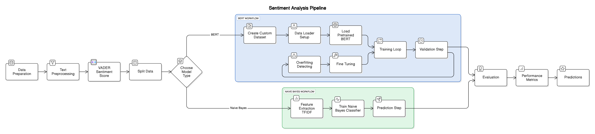

# Sentiment Analysis of Airline Reviews – Capstone Project

## About
This project explores the application of sentiment analysis on verified airline reviews collected from Skytrax. The aim is to uncover customer sentiment trends and determine key drivers of satisfaction or dissatisfaction, using a range of machine learning and deep learning techniques.

  

*A visual overview of the sentiment analysis pipeline. Created by Emely Ben-Sadon using Eraser.io (an AI tool); April 5, 2025.*
[View on Eraser](https://app.eraser.io/workspace/z48nJv0aMvHimOS8FYfM)

This diagram illustrates a Sentiment Analysis Pipeline with two model paths: BERT (in blue) and Naive Bayes (in green). It starts with Data Preparation and Preprocessing, flows through a Model Selection Step, then splits into either a Deep Learning Workflow with BERT or a classical Machine Learning Workflow with Naive Bayes. Each path includes Training and Evaluation Steps, ending with Performance Metrics and Final Predictions.

## Data

The data was sourced from [Skytrax](https://www.airlinequality.com/), containing verified passenger reviews. Each review includes both free-text feedback and ratings across categories like:

- Cabin Staff Service  
- Food & Beverages  
- Inflight Entertainment  
- Wifi Connectivity
- Ground Service 
- Value for Money  
- Overall Rating  

We preprocessed the data by cleaning the text, handling missing values, and addressing class imbalance caused by a predominance of negative reviews.
The "Overall Rating" column contains ordinal categories ranging from 1 to 9, while the other rating columns also use ordinal scales, typically ranging from 1 to 5.

---

## Dataset Overview

The initial analysis revealed a strong negative bias in the reviews, reflecting the tendency of customers to share negative experiences more frequently than positive ones. Additionally, the neutral class contained very few reviews, making it statistically insignificant. To address this, we corrected for the class imbalance and reframed the problem as a binary classification task, focusing solely on positive (1) and negative (0) sentiment classes to ensure fair and effective model training and evaluation.

---

## Exploratory Data Analysis (EDA)

We performed descriptive statistics and created visualizations to examine feature distributions and relationships. This helped us understand how individual parameters influence overall sentiment and prepared the data for modeling.

---

## Modeling Approaches

We explored several modeling techniques to classify sentiment:

- **VADER (Lexicon-Based)**  
  Quick baseline using sentiment scoring from predefined word lists; labels based on the Overall Rating receiving Sentiment Score and Label for prediciton.

- **Naive Bayes (Machine Learning Approach)**  
  Classic probabilistic model using vectorized text features; reached ~79 % accuracy on test data.

- **Custom BERT Model (Deep Learning Approach)**  
  Initially built a BERT model with custom layers, but limited dataset size hindered performance.

- **Fine-Tuned Pretrained BERT (Hugging Face)**  
  Used a pretrained transformer and fine-tuned it on our dataset; achieved ~89% test accuracy.

---

## Key Findings

The fine-tuned BERT model achieved high accuracy in distinguishing between positive and negative sentiments. It showed stable performance across training and validation, with strong results on key evaluation metrics such as precision, recall, and F1-score—all above 87%. The model generalized well and demonstrated reliable classification ability, making it effective for binary sentiment analysis.

---

## Contributors

Developed as a Capstone Project in Industrial Engineering and Managment specialized in Information Systems. 

Author: **Emely Ben-Sadon, Yarin Horev**   
Director: **Dr. Dima Alberg**   

Tech stack includes: Python, Scikit-learn, PyTorch, Hugging Face Transformers, Matplotlib, and Streamlit.
