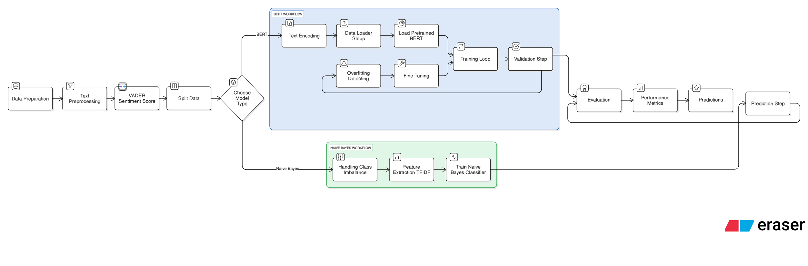

# Sentiment Analysis of Airline Reviews – Capstone Project

## About
This project explores the application of sentiment analysis on verified airline reviews collected from Skytrax. The aim is to uncover customer sentiment trends and determine key drivers of satisfaction or dissatisfaction, using a range of machine learning and deep learning techniques.

  

*A visual overview of the sentiment analysis pipeline. Created by Emely Ben-Sadon using Eraser.io (an AI tool); April 5, 2025.*
[View on Eraser](https://app.eraser.io/workspace/z48nJv0aMvHimOS8FYfM)

This diagram illustrates a Sentiment Analysis Pipeline with two model paths: BERT (in blue) and Naive Bayes (in green). It starts with Data Preparation and Preprocessing, flows through a Model Selection Step, then splits into either a Deep Learning Workflow with BERT or a classical Machine Learning Workflow with Naive Bayes. Each path includes Training, Validation and Evaluation Steps, ending with Performance Metrics and Final Predictions.

## Data

The data was sourced from [Skytrax](https://www.airlinequality.com/), containing verified passenger reviews. Each review includes both free-text feedback and ratings across categories like:

- Overall Rating
- Seat Comfort  
- Cabin Staff Service  
- Food & Beverages  
- Inflight Entertainment  
- Wifi Connectivity
- Ground Service 
- Value for Money

The "Overall Rating" column contains ordinal categories ranging from 1 to 9, where 1 indicates very negative and 9 indicates very positive sentiment. The other rating columns also use ordinal scales, typically ranging from 1 to 5, where 1 is poor and 5 is excellent. 
We preprocessed the data by cleaning the text, handling missing values, and addressing class imbalance caused by a predominance of negative reviews.

---

## Dataset Overview

The initial analysis revealed a strong negative bias in the reviews, reflecting the tendency of customers to share negative experiences more frequently than positive ones. Additionally, the neutral class contained very few reviews, making it statistically insignificant. To address this, we corrected for the class imbalance and reframed the problem as a binary classification task, focusing solely on positive (1) and negative (0) sentiment classes to ensure fair and effective model training and evaluation.

---

## Exploratory Data Analysis (EDA)

We performed descriptive statistics and created visualizations to examine feature distributions and relationships. This helped us understand how individual parameters influence overall sentiment and prepared the data for modeling.

---

## Modeling Approaches

With the data prepared, we then proceeded to explore various modeling techniques to classify sentiment:

- **VADER (Lexicon-Based)**  
  A quick baseline using sentiment scoring from predefined word lists. Labels were generated by mapping the Overall Rating to sentiment scores for   prediction.
- **Naive Bayes (Machine Learning Approach)**  
  A classic probabilistic model using vectorized text features; it reached ~79% accuracy on test data.

- **BERT with Custom Classification Head (Deep Learning Approach)**  
  Initially, we fine-tuned a pre-trained BERT model from Hugging Face, but built our own custom classification layers for the head. However, the     limited dataset size hindered its performance.

- **BERT with Pre-built Classification Head (Hugging Face)**  
  We fine-tuned a pre-trained BERT transformer that came with an integrated classification head from Hugging Face, achieving ~89% test accuracy.

---

## Key Findings

The BERT model with the Pre-built Classification Head (Hugging Face) achieved high accuracy in distinguishing between positive and negative sentiments. It showed stable performance across training and validation, with strong results on key evaluation metrics such as precision, recall, and F1-score—all above 87%. This model generalized well and demonstrated reliable classification ability, making it highly effective for binary sentiment analysis.

---

## Repository Structure

The project is organized as follows:

- Airline_review.csv/: Contains raw and processed datasets.
- Sentiment_Analysis_Project_of_Airline_Customer_Review_(B_Sc_)EmelYarin.ipynb/: Jupyter notebook for EDA, model experimentation, training and evaluation.
- best_fine_tuned_bert/: Saved trained model weights and artifacts.
- app.py/: Streamlit application files.
- requirements.txt: List of project dependencies.
- devcontainer/: Contains configuration files for a standardized development environment (GitHub Codespaces).
- picture/: Project diagrams and visualizations.

## Contributors

Developed as a Capstone Project in Industrial Engineering and Managment specialized in Information Systems. 

Author: **Emely Ben-Sadon, Yarin Horev**   
Director: **Dr. Dima Alberg**   

Tech stack includes: Python, Scikit-learn, Matplotlib, Pandas, Gspread, PyTorch, Hugging Face Transformers and Streamlit.
